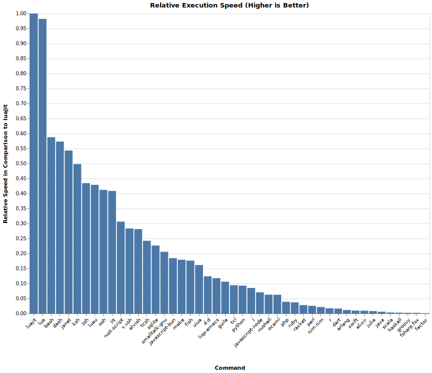

# Interpreted Languages Benchmark

Benchmark for interpreted languages.



The values for Rust, V, Swift, D and Haskell are not really representative
as they are compiled on the first run
and Haskell unfortunately does not even cache the compiled binary.


## Languages

- [Bash]
- [Bun]
- [D]
- [Dart]
- [Dash]
- [Elixir]
- [Elvish]
- [F#]
- [Fish]
- [Guile]
- [Haskell]
- JavaScript via
  - [Node.js]
  - [Deno]
  - [Bun]
- [Julia]
- [Ksh]
- [Lua]
- [Lua]
- [Nickel]
- [Nix Language]
- [Nushell]
- [OCaml]
- [Osh]
- [Perl]
- [PHP]
- TypeScript via
  - [Deno]
  - [Bun]
- [Python]
- [Python]
- [R]
- [Racket]
- [Roc.roc]
- [Ruby]
- [Scala]
- [Swift]
- [Typst]
- [V]

[Bash]: https://www.gnu.org/software/bash/
[Bun]: https://bun.sh/
[D]: https://dlang.org
[Dart]: https://dart.dev/
[Dash]: https://wiki.archlinux.org/title/Dash
[Deno]: https://deno.com/
[Elixir]: https://elixir-lang.org/
[Elvish]: https://elv.sh/
[F#]: https://fsharp.org/
[Fish]: https://fishshell.com/
[Guile]: https://www.gnu.org/software/guile/
[Haskell]: https://www.haskell.org/
[Julia]: https://julialang.org/
[Ksh]: https://www.kornshell.com/
[Lua]: https://www.lua.org/
[Nickel]: https://nickel-lang.org/
[Nix Language]: https://nixos.org/manual/nix/stable/language/
[Node.js]: https://nodejs.org/
[Nushell]: https://www.nushell.sh/
[OCaml]: https://ocaml.org/
[Osh]: https://www.oilshell.org/
[Perl]: https://www.perl.org/
[PHP]: https://www.php.net/
[Python]: https://www.python.org/
[R]: https://www.r-project.org
[Racket]: https://racket-lang.org/
[Roc.roc]: https://roc-lang.org/
[Ruby]: https://www.ruby-lang.org/
[Scala]: https://www.scala-lang.org/
[Swift]: https://swift.org/
[Typst]: https://typst.app/docs/
[V]: https://vlang.io/


### Workarounds

- [Typst] \
    Can only output a JSON string.
    Use `… | jq -r` to remove the quotes.


## Result

Check out the workflow runs for the latest benchmark results.


### GitHub's MacOS 14 Runner

#### Bucket Calc

```txt
lua bucket-calc/main.lua ran
  2.96 ± 3.97 times faster than nickel export bucket-calc/main.ncl
  3.05 ± 3.98 times faster than bun run bucket-calc/main.js
  3.09 ± 4.07 times faster than bun run bucket-calc/main.ts
  4.71 ± 5.77 times faster than python3 bucket-calc/main.py
  4.76 ± 5.83 times faster than deno run bucket-calc/main.ts
  4.80 ± 5.91 times faster than deno run bucket-calc/main.js
  8.56 ± 10.56 times faster than node bucket-calc/main.js
  24.21 ± 29.52 times faster than
                typst query --field=text --one bucket-calc/main.typ
```


#### Shebang Scripts

```txt
./luajit ran
  1.06 ± 0.22 times faster than ./lua
  1.61 ± 0.27 times faster than ./bash
  1.62 ± 0.29 times faster than ./dash
  2.12 ± 0.49 times faster than ./ksh
  2.66 ± 0.55 times faster than ./osh
  3.77 ± 0.63 times faster than ./elvish
  3.91 ± 0.67 times faster than ./v.vsh
  4.92 ± 0.82 times faster than ./fish
  6.16 ± 1.02 times faster than ./bun
  9.65 ± 1.72 times faster than ./guile
  13.94 ± 2.29 times faster than ./python
  14.20 ± 2.39 times faster than ./nushell
  17.43 ± 2.86 times faster than ./php
  23.01 ± 3.94 times faster than ./ocaml
  35.43 ± 5.99 times faster than ./ruby
  52.94 ± 9.08 times faster than ./racket
  56.77 ± 9.59 times faster than ./perl
  89.13 ± 14.62 times faster than ./dart
106.23 ± 18.77 times faster than ./swift
143.96 ± 24.03 times faster than ./julia
199.84 ± 33.40 times faster than ./roc.roc
224.83 ± 47.56 times faster than ./elixir
483.43 ± 87.95 times faster than ./haskell
507.16 ± 114.14 times faster than ./scala
528.19 ± 94.47 times faster than ./fsharp.fsx
```


## Related

- [jinyus/related_post_gen] - Data Processing benchmark
- [plb2] - A programming language benchmark
- [Programming-Language-Benchmarks][PLB]
- [script-bench-rs] - Rust embedded scripting languages benchmark

[jinyus/related_post_gen]: https://github.com/jinyus/related_post_gen
[PLB]: https://github.com/hanabi1224/Programming-Language-Benchmarks
[plb2]: https://github.com/attractivechaos/plb2
[script-bench-rs]: https://github.com/khvzak/script-bench-rs
