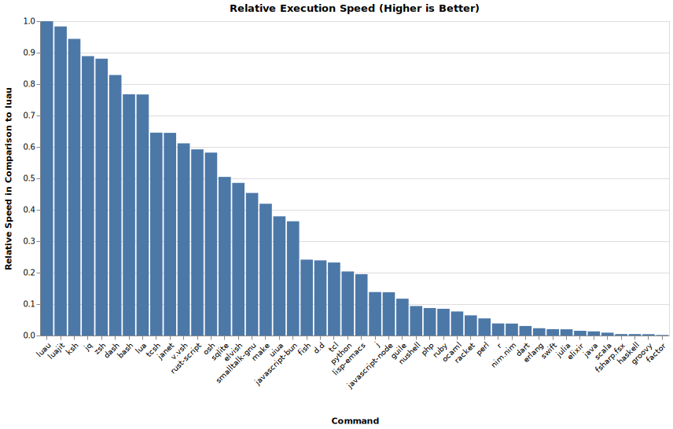

# Interpreted Languages Benchmark

Benchmark for interpreted languages.

## Interpreted Languages

The values for Rust, V, Swift, D and Haskell are not really representative
as they are compiled on the first run
and Haskell unfortunately does not even cache the compiled binary.

## Compiled Languages

## Bucket Calc

Calculates logarithmically-spaced histogram bin edges.

## All Languages

- [Bash]
- [D]
- [Dart]
- [Dash]
- [Elixir]
- [Elvish]
- [Erlang]
- [F#]
- [Fish]
- [Forth]
- [Groovy]
- [Haskell]
- [Java]
- [J]
- [JavaScript] via
  - [Node.js]
  - [Deno]
  - [Bun]
- [Julia]
- [Ksh]
- [Lisp] via
  - [Guile]
  - [Emacs Lisp]
- [Lua]
- [Luau]
- [Nickel]
- [Nim]
- [Nix Language]
- [Nushell]
- [OCaml]
- [Osh]
- [Perl]
- [PHP]
- [TypeScript] via
  - [Node.js]
  - [Deno]
  - [Bun]
- [Prolog] via
  - [SWI-Prolog]
  - [GNU Prolog]
- [Python]
- [R]
- [Racket]
- [Roc.roc]
- [Ruby]
- [Scala]
- [Swift]
- [Typst]
- [Uiua]
- [V]

[Bash]: https://www.gnu.org/software/bash/
[Bun]: https://bun.sh/
[D]: https://dlang.org
[Dart]: https://dart.dev/
[Dash]: https://wiki.archlinux.org/title/Dash
[Deno]: https://deno.com/
[Elixir]: https://elixir-lang.org/
[Elvish]: https://elv.sh/
[Emacs Lisp]: https://www.gnu.org/software/emacs/manual/html_node/elisp/index.html
[Erlang]: https://www.erlang.org/
[F#]: https://fsharp.org/
[Fish]: https://fishshell.com/
[Forth]: https://www.gnu.org/software/gforth/
[GNU Prolog]: https://www.gnu.org/software/gprolog/
[Groovy]: https://groovy-lang.org/
[Guile]: https://www.gnu.org/software/guile/
[Haskell]: https://www.haskell.org/
[J]: https://www.jsoftware.com/
[Java]: https://www.java.com/
[JavaScript]: https://en.wikipedia.org/wiki/JavaScript
[Julia]: https://julialang.org/
[Ksh]: https://www.kornshell.com/
[Lisp]: https://en.wikipedia.org/wiki/Lisp_(programming_language)
[Lua]: https://www.lua.org/
[Luau]: https://luau-lang.org/
[Nickel]: https://nickel-lang.org/
[Nim]: https://nim-lang.org/
[Nix Language]: https://nixos.org/manual/nix/stable/language/
[Node.js]: https://nodejs.org/
[Nushell]: https://www.nushell.sh/
[OCaml]: https://ocaml.org/
[Osh]: https://www.oilshell.org/
[Perl]: https://www.perl.org/
[PHP]: https://www.php.net/
[Prolog]: https://en.wikipedia.org/wiki/Prolog
[Python]: https://www.python.org/
[R]: https://www.r-project.org
[Racket]: https://racket-lang.org/
[Roc.roc]: https://roc-lang.org/
[Ruby]: https://www.ruby-lang.org/
[Scala]: https://www.scala-lang.org/
[SWI-Prolog]: https://www.swi-prolog.org/
[Swift]: https://swift.org/
[TypeScript]: https://www.typescriptlang.org/
[Typst]: https://typst.app/docs/
[Uiua]: https://www.uiua.org/
[V]: https://vlang.io/

### Workarounds

- [Typst] \
    Can only output a JSON string.
    Use `… | jq -r` to remove the quotes.

## Result

Check out the
[workflow runs](https://github.com/Airsequel/interpreted-languages-benchmark/actions)
for the latest benchmark results.

## Related

- [BenchGen] - Automatic generation of benchmarks to stress-test systems.
- [Completely Unscientific Benchmarks] - Naive performance comparison of several languages
- [Count Words] - Counting words in Python, Go, C++, C, AWK, Forth, and Rust
- [ffi-overhead] - Comparing the C FFI overhead of various programming languages
- [gradbench] - Benchmarks for differentiable programming across languages and domains
- [jinyus/related_post_gen] - Data Processing benchmark
- [Languages] - Comparing programming languages with micro benchmarks
- [plb2] - A programming language benchmark
- [Programming-Language-Benchmarks][PLB]
- [script-bench-rs] - Rust embedded scripting languages benchmark
- [Sharkbench] - Benchmarking programming languages and web frameworks.
- [SpeedTests] - Comparing the execution speeds of various programming languages.

[BenchGen]: https://github.com/lac-dcc/BenchGen
[Completely Unscientific Benchmarks]: https://github.com/frol/completely-unscientific-benchmarks
[Count Words]: https://benhoyt.com/writings/count-words/
[ffi-overhead]: https://github.com/dyu/ffi-overhead
[gradbench]: https://github.com/gradbench/gradbench
[jinyus/related_post_gen]: https://github.com/jinyus/related_post_gen
[Languages]: https://github.com/bddicken/languages
[PLB]: https://github.com/hanabi1224/Programming-Language-Benchmarks
[plb2]: https://github.com/attractivechaos/plb2
[script-bench-rs]: https://github.com/khvzak/script-bench-rs
[Sharkbench]: https://github.com/sharkbench/sharkbench
[SpeedTests]: https://github.com/jabbalaci/SpeedTests
